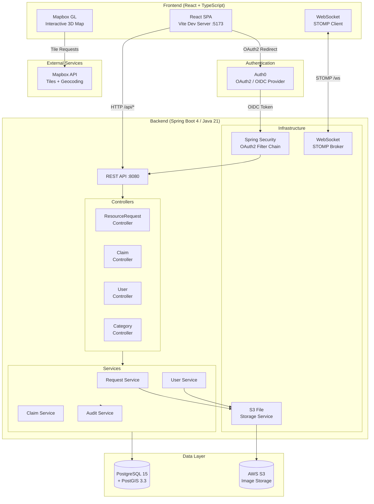
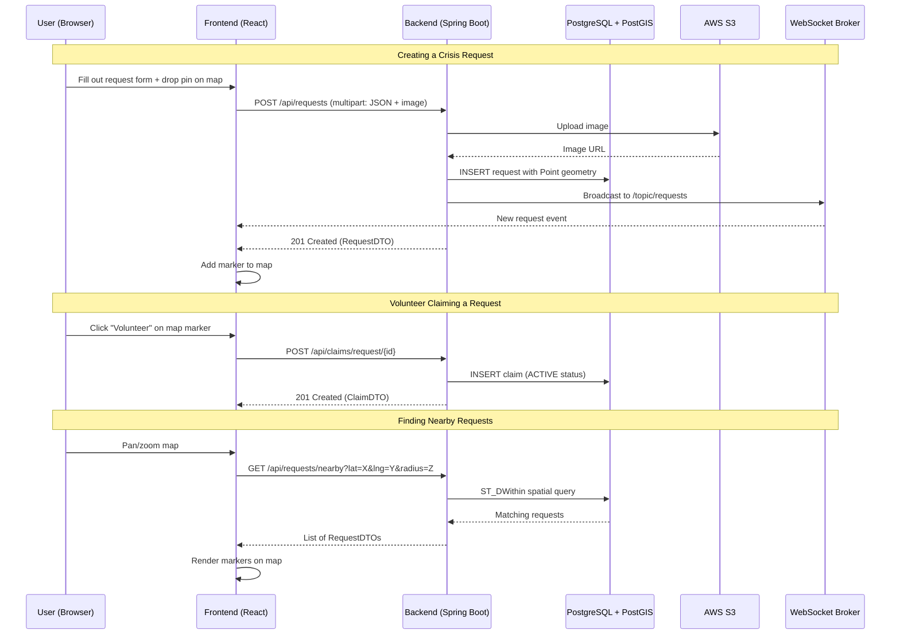

# crisisRouter

A full-stack crisis management platform that connects people in need of emergency assistance with volunteer responders through real-time, location-based coordination on an interactive map.

---

## Table of Contents

- [Overview](#overview)
- [System Architecture](#system-architecture)
- [Features](#features)
- [Tech Stack](#tech-stack)
- [Project Structure](#project-structure)
- [Prerequisites](#prerequisites)
- [Getting Started](#getting-started)
- [API Reference](#api-reference)
- [Authentication](#authentication)
- [WebSocket (Real-Time)](#websocket-real-time)
- [Testing](#testing)
- [Configuration Reference](#configuration-reference)

---

## Overview

crisisRouter enables users to create geolocated crisis requests (medical emergencies, food shortages, security threats, natural disasters, etc.) that appear on a shared interactive map. Volunteers in the area can browse nearby requests, claim them, and coordinate fulfillment — all in real time.

The backend uses **PostGIS** spatial queries to efficiently find requests within a given radius, and **WebSockets** to push live updates to connected clients.

---

## System Architecture



### Data Flow



---

## Features

| Feature | Description |
|---|---|
| **Interactive Map** | Mapbox GL-powered 3D map with clustered markers and fly-to navigation |
| **Crisis Requests** | Create requests with title, description, location, severity (1–4), category, and optional image |
| **Geospatial Search** | Find nearby requests using PostGIS radius queries |
| **Volunteer System** | Claim, complete, or drop requests; view active commitments |
| **Real-Time Updates** | WebSocket/STOMP broadcasting for live request notifications |
| **Image Uploads** | Attach photos to requests via AWS S3 |
| **User Profiles** | Location, phone, bio, and profile image management |
| **Onboarding Tour** | Guided walkthrough for first-time users |
| **Audit Logging** | JSON-based change tracking for all request mutations |
| **Demo Mode** | Auto-generates sample requests for testing and demos |

---

## Tech Stack

### Backend
- **Java 21** / **Spring Boot 4.0.2** / **Maven**
- **PostgreSQL 15** with **PostGIS 3.3** (spatial queries)
- **Hibernate Spatial** + **JTS** (geometry calculations)
- **Spring Security** with **OAuth2 / Auth0**
- **Spring WebSocket** (STOMP protocol)
- **AWS S3** (file storage)
- **MapStruct** (DTO mapping) / **Lombok** (boilerplate reduction)

### Frontend
- **React 19** / **TypeScript 5.9** / **Vite 7**
- **Mapbox GL** + **react-map-gl** (interactive maps)
- **Tailwind CSS 4** (styling)
- **React Router 7** (SPA navigation)

### Infrastructure
- **Docker** & **Docker Compose**
- **Testcontainers** (integration testing)

---

## Project Structure

```
crisisRouter/
├── src/main/java/com/crisisrouter/crisisRouter/
│   ├── controller/          # REST API endpoints
│   ├── service/
│   │   ├── impl/            # Business logic implementations
│   │   ├── dto/             # Data transfer objects
│   │   └── mapper/          # MapStruct entity/DTO mappers
│   ├── model/entity/        # JPA entities & enums
│   ├── repository/          # Spring Data JPA repositories
│   ├── config/              # Security, WebSocket, S3 configuration
│   └── security/            # OAuth2 success handler
├── src/main/resources/
│   ├── application.properties
│   └── import.sql           # Seed data (categories)
├── src/test/java/           # Multi-layer test suite
├── frontend/
│   ├── src/
│   │   ├── pages/           # Home, YourRequests, YourActions, YourProfile
│   │   ├── components/      # CrisisRequestForm, ActiveRequestCard, etc.
│   │   ├── onboarding/      # Guided tour system
│   │   └── utils/           # Demo request generator
│   ├── package.json
│   └── vite.config.ts
├── docker-compose.yml
├── Dockerfile
└── pom.xml
```

---

## Prerequisites

- **Java 21** JDK
- **Node.js 18+** and npm
- **Docker** & Docker Compose
- **Maven 3.9+** (or use the included `mvnw` wrapper)
- A **Mapbox** access token
- **Auth0** application credentials
- **AWS S3** bucket and credentials (optional — only for image uploads)

---

## Getting Started

### 1. Clone the repository

```bash
git clone <repository-url>
cd crisisRouter
```

### 2. Configure environment variables

Create a `.env` file in the project root:

```env
# Auth0
AUTH0_CLIENT_ID=your-client-id
AUTH0_CLIENT_SECRET=your-client-secret
AUTH0_DOMAIN=your-tenant.auth0.com

# AWS S3 (optional)
S3_BUCKET_NAME=your-bucket-name
AWS_ACCESS_KEY=your-access-key
AWS_SECRET_KEY=your-secret-key
```

Create a `.env` file in the `frontend/` directory:

```env
VITE_MAPBOX_TOKEN=your-mapbox-access-token
```

### 3. Start the database

```bash
docker-compose up -d
```

This launches PostgreSQL 15 + PostGIS on port **5432** with:
- Database: `crisis_router`
- User: `devuser` / Password: `devpassword`

Five default categories are seeded automatically via `import.sql`.

### 4. Run the backend

```bash
./mvnw spring-boot:run
```

The API will be available at `http://localhost:8080`.

### 5. Run the frontend

```bash
cd frontend
npm install
npm run dev
```

The app will be available at `http://localhost:5173`. Vite proxies `/api`, `/oauth2`, and `/login/oauth2` requests to the backend automatically.

---

## API Reference

### Requests

| Method | Endpoint | Description |
|---|---|---|
| `POST` | `/api/requests` | Create a request (multipart: JSON + optional image) |
| `GET` | `/api/requests/me` | List current user's requests |
| `GET` | `/api/requests/{id}` | Get a single request |
| `GET` | `/api/requests/nearby?latitude=X&longitude=Y&radiusInMeters=Z` | Find requests within radius |
| `PUT` | `/api/requests/{id}` | Edit a request (OPEN status only) |
| `PATCH` | `/api/requests/{id}?status=FULFILLED\|CANCELLED` | Update request status |

### Claims (Volunteering)

| Method | Endpoint | Description |
|---|---|---|
| `POST` | `/api/claims/request/{requestId}?volunteerId=UUID` | Volunteer for a request |
| `GET` | `/api/claims/volunteer/{volunteerId}` | List a volunteer's claims |
| `GET` | `/api/claims/request/{requestId}` | List volunteers for a request |
| `GET` | `/api/claims/me` | Current user's claims |
| `PATCH` | `/api/claims/{claimId}/complete` | Mark a claim as completed |
| `PATCH` | `/api/claims/{claimId}/drop` | Withdraw from a claim |

### Users

| Method | Endpoint | Description |
|---|---|---|
| `GET` | `/api/users/me` | Get current user profile |
| `PUT` | `/api/users/me` | Update profile (multipart: JSON + optional image) |

### Categories

| Method | Endpoint | Description |
|---|---|---|
| `GET` | `/api/categories` | List all categories |
| `GET` | `/api/categories/{id}` | Get a single category |

---

## Authentication

crisisRouter uses **OAuth2 with Auth0** for authentication.

**Flow:**
1. Frontend redirects the user to `/oauth2/authorization/auth0`
2. Auth0 handles login and redirects back with an authorization code
3. Spring Security exchanges the code for tokens and extracts user info (email, name) from OIDC claims
4. A user record is automatically created or updated in the database
5. Session-based authentication is maintained via Spring Security

All API endpoints except `/api/categories` require authentication. CORS is configured for `http://localhost:5173` with credentials enabled.

---

## WebSocket (Real-Time)

The backend exposes a STOMP WebSocket endpoint at `/ws`.

| Destination | Type | Description |
|---|---|---|
| `/topic/requests` | Public | Broadcasts new/updated requests to all connected clients |
| `/queue/private` | Private | Sends user-specific notifications |

---

## Testing

The project includes a comprehensive multi-layer test suite using **JUnit 5**, **Spring Boot Test**, and **Testcontainers** (requires Docker running).

```bash
# Run all tests
./mvnw test

# Run a specific test class
./mvnw test -Dtest=ResourceRequestControllerTest

# Skip tests during build
./mvnw clean package -DskipTests
```

**Test coverage includes:**
- **Controller tests** — integration tests for all REST endpoints
- **Service tests** — unit tests for business logic
- **Repository tests** — data access layer verification
- **Test utilities** — `SecurityTestUtil` for mock auth, `TestDataFactory` for fixtures

---

## Configuration Reference

### application.properties

| Property | Description |
|---|---|
| `spring.datasource.url` | PostgreSQL connection URL (default: `jdbc:postgresql://localhost:5432/crisis_router`) |
| `spring.jpa.hibernate.ddl-auto` | Schema management strategy (default: `update`) |
| `aws.s3.bucket-name` | S3 bucket for image uploads |
| `aws.s3.region` | AWS region (default: `us-east-2`) |
| `spring.security.oauth2.client.registration.auth0.*` | Auth0 OAuth2 credentials |
| `spring.security.oauth2.client.provider.auth0.issuer-uri` | Auth0 issuer URL |

### docker-compose.yml

| Service | Image | Port | Purpose |
|---|---|---|---|
| `db` | `postgis/postgis:15-3.3` | 5432 | PostgreSQL with PostGIS spatial extensions |

### Seeded Categories

The database is seeded with five default crisis categories on first run:

1. **Food** — Emergency food and water supplies
2. **Medical** — First aid and medical assistance
3. **Security** — Safety and security concerns
4. **Natural Disaster** — Earthquakes, floods, storms, etc.
5. **Other** — Custom/uncategorized requests
